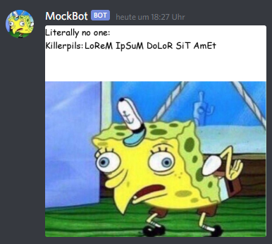

# MockBot

This is the MockBot for discord.


Key features:
* mock other users with the spongebob meme

In contrast to the 'competition' this bot uses the correct image for the meme. It does NOT only send plain text when using the commands.





## Setup

You can change the prefix with ```m!prefix .```.
If you put yourself on the auto-mock list, kick the bot from the server and re-invite him. The bot deletes its settings on kick.


## Commands


|Commands||
|---|---|
|``` mock <user?>```  | take the last message and create the spongebob mocking meme  | 
| ```mockmanage [compl.]```  | manage the list of auto-mocked users (admin only)
| ```prefix <string>```  | change the prefix of the bot|


## MockManage

When putting a user onto the auto-mock, the bot will automatically apply the 'mock' command to his messages.

NOTE: this can prevent the user from using other commands, depending on which bot is faster in processing.

```
*mockmanage <mode>
	available modes
	• ls - list all users on the mock-list
	• add <user..> -add the given user to the list
	• rm <user..> - remove the given user from the list

	• remove - alias for rm
	• list - alias for ls
```


### Github
https://github.com/Mayerch1/MockBot